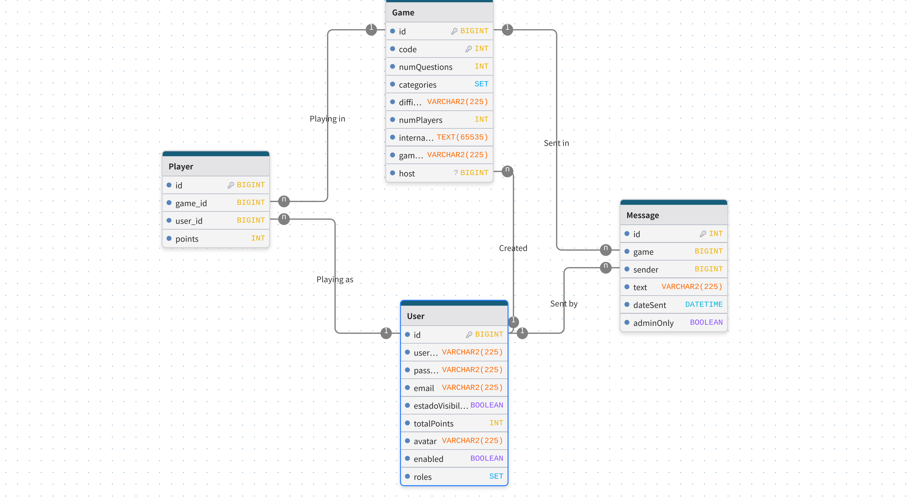

# TriviaBlast

**Juego de preguntas y respuestas en línea** para jugar de forma individual o en salas multijugador (hasta 8 jugadores).

## Propuesta

### Descripción

TriviaBlast es un juego interactivo que permite a los usuarios practicar y ganar puntos en partidas individuales, o competir en un tablero clásico con categorías por colores en salas privadas. Las preguntas se obtienen de la [Open Trivia Database (OpenTDB)](https://opentdb.com/), ofreciendo una amplia variedad de categorías y niveles de dificultad.

### Roles y permisos

| Rol           | Permisos                                                                 |
|---------------|--------------------------------------------------------------------------|
| **Jugador**   | Gestionar cuenta, jugar partidas individuales/multijugador, ver leaderboard. |
| **Administrador** | Ocultar, editar, borrar o restaurar visibilidad de usuarios. |

### Modalidades de juego

#### Partida individual

- Configuración personalizada: número de preguntas, categoría y dificultad.
- Límite de tiempo por pregunta.
- Puntuación basada en dificultad y rapidez al responder.

#### Partida multijugador

- Sala privada con código de invitación.
- Tablero por turnos, con categorías por colores.
- Gana el primer jugador que complete correctamente todas las categorías.

### Sistema de puntos y leaderboard

- Los puntos se obtienen según el tipo de partida y se reflejan en el leaderboard (solo visible para usuarios registrados).
- Los jugadores aparecen ordenados de mayor a menor puntuación.
- Los administradores pueden ocultar jugadores del leaderboard.

### Flujo de juego resumido

1. Registro o inicio de sesión.
2. Selección de modalidad de juego.
3. Desarrollo de la partida.
4. Cálculo de puntos y actualización del leaderboard.

## Estructura de la BD

Algunos puntos posibles a cambiar:

- Cambiar el nombre de `estadoVisibilidad` a algo en inglés que indique lo que significa que esté a true o false.
- `code` no tiene por qué ser único, puede ser único solo entre las partidas activas.
- Tal y como se muestra en el diagrama, user de Player debería ser un id en lugar de todo el objeto (para tener modularidad y seguridad). Ídem para los otros objetos que se usan en su totalidad en otros modelos.

## Estado de la implementación

### Terminada

- **Sign in or up**: La implementación del registro de una cuenta o del inicio de sesión está correctamente implementada, se manejan casos de error (como cuando se insertan dos contraseñas distintas al crear una cuenta). Al crear cuenta se inicia la sesión automáticamente.
- **Inicio**: Implementado correctamente. Dispone de un botón para unirse a una partida multijugador mediante un código cuando no se ha iniciado sesión. Una vez iniciada la sesión, se pueden ver también los botones para crear una partida multijugador o empezar una partida de un solo jugador. Actualmente solo este último hace algo.
- **Partida individual**: Dispone de dos vistas. La primera, referida a la creación de la partida con sus ajustes, está completamente implementada. Los tipos de preguntas se corresponden a los de la API usada. La partida de un solo jugador en sí también se encuentra completamente implementada. Se muestran las preguntas y posibles respuestas. Al fallar una pregunta se muestra cual hubiese sido la correcta. Cabe mencionar que la validación de las preguntas se realiza completamente en el backend, por lo que se imposibilita el hacer trampas (para comprobar que el frontend nunca recibe las respuestas correctas, inicie una partida individual, abra la consola del navegador e introduzca `window.questions`). Hay un botón para abandonar la partida, y se muestra en qué número de pregunta y cantidad de puntos se han acumulado por el momento. Al acertar una pregunta el usuario recibe 10 puntos.
- **Perfil de usuario**: Muestra la foto de perfil, nombre, y cantidad de puntos del usuario. También le permite cerrar la sesión o borrar completamente su cuenta. El botón `edit`, le permite cambiar su foto de perfil, su nombre y correo, o su contraseña (acción que se deberá validar con la contraseña anterior). En el futuro, cuando se disponga de la funcionalidad de las partidas multijugador, podremos mostrarlas en el perfil del usuario (como retrospectiva).

### En progreso

- **Scoreboard**: La estructura frontend necesaria está implementada. Solo los admins pueden ver el botón para ocultar usuarios. Faltaría que los usuarios mostrados procedan de la base de datos, y que la ocultación tuviese efecto real (se aplicase a nivel de base de datos).
- **Partida multijugador**: Solo está implementada la vista estática. Para configurar la partida podemos reciclar la funcionalidad otorgada por la configuración de la partida individual, sin embargo faltaría implementar:
  1. La capacidad de conectar jugadores al juego (generación y funcionalidad de código para sala activa)
  2. La lógica del juego
  3. La capacidad de enviar mensajes a la partida o a los admins
  4. La recepción de puntos al finalizar la partida
- **Barra de navegación**: Actualmente responde a una estructura deseada para el debugging de la aplicación y la visualización de las vistas que siguen siendo estáticas. Sin embargo, en el futuro tendrá una estructura más común para una aplicación online práctica (casa, perfil/login), mientras que las vistas referidas al juego serán accesibles desde los botones correspondientes en la "casa".

### Otras cosas

- El despliegue de la aplicación en máquina virtual funciona correctamente.
- Actualmente, la aplicación no dispone de pruebas, aunque se realizarán.
